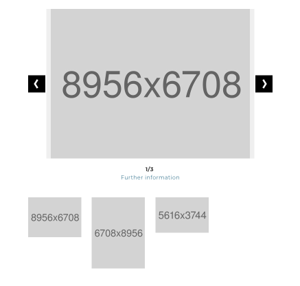

# plan2net/fake-fal

Create missing files on the fly for testing/development.

# What does it do?

Instead of keeping gigabytes of files in sync with your test/development system, the extension creates useful fake files.
It acts like a local file driver and creates missing files with the correct file signature (and in case of images in the original file's dimensions) and folders, so PHP's finfo (and others) return the correct mime type.

You can let the extension create fake files on the fly (when visiting a page in the browser) or create fake files for all files which are not available on disk at once via a command (Backend > Scheduler or command line).

# Installation

Require the composer package:

    composer require "plan2net/fake-fal" --dev

Activate the extension in the Extension Manager and update the settings.

You have to explicitely set the flag `enable` to register the fake local driver.

    enable = 1 (default is 0 = inactive)

Set an image generator

    imageGeneratorType = Plan2net\FakeFal\Resource\Generator\LocalFakeImageGenerator
    
(Currently there's only one local image generator available, so just stick with the default value)

Save the configuration.

After activating the local fake driver globally, you have to activate the fake mode for specific local storages.
Either via backend (by editing the storage record) or via command line command:

    fakestorage:togglefakemode
    
will set all local storages to fake mode.

    fakestorage:togglefakemode 2,14,99
    
will set the given storages (with ID `2`, `14` and `99`) to fake mode.

## Available Commands:

    fakestorage:togglefakemode
    
Set given storage(s) to fake mode: check flag for fake mode, clear processed files

    fakestorage:createfakefiles
    
Create fake files within given storage(s); the existing real files will be kept

# Compatibility

The extension is tested and works with TYPO3 CMS LTS 8.7 and 9.5 and PHP > 7.1.
Support for TYPO3 CMS 6 and 7 and PHP < 7.1 has been dropped deliberatly.

# Integration information

We extend the core class `\TYPO3\CMS\Core\Resource\ResourceFactory` to overcome the hardcoded check with `is_file` in the method `retrieveFileOrFolderObject`. Just be aware of this if you use any other extension doing so or extend the class yourself.

# Alternatives

There's the [_filefill_](https://github.com/IchHabRecht/filefill) extension from Nicole Cordes.

Here's the story: I had the idea for _plan2net/fake-fal_ for quite a while and there was a Fedex Day (a day where we explore new ideas and create cool things in our company) I wanted to create this extension. The result after one day of coding was the first working version. 

This was around two weeks after Nicole published her extension. I didn't know anything about it. A week later a colleague said 
> Hey, I heard about an extension that sounds like yours!
 
At first I was dissappointed, but gladly there's quite a difference.

_plan2net/fake-fal_ works offline and creates the files locally. Additionally the file dimensions are written into the fake images.
And if you download a fake PDF it will behave like a real document.
